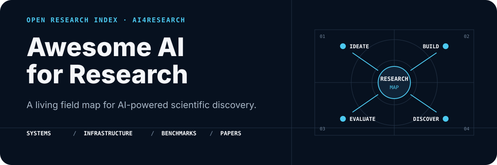

<p align="center">
  
</p>

<p align="center">
  <a href="README.md"><strong>English</strong></a> ·
  <a href="README_zh.md">简体中文</a> ·
  <a href="#explore-the-map">Explore the map</a> ·
  <a href="https://github.com/pengqianhan/awesome-AI-for-research/issues">Suggest a resource</a>
</p>

> A living, bilingual index of projects and ideas shaping AI-powered research—from autonomous scientists and agent infrastructure to evaluation benchmarks and research-native artifacts.

This repository is a field guide for understanding the AI4Research ecosystem. It organizes representative systems, papers, infrastructure, and benchmarks by the role they play in the research loop, making it easier to compare approaches, spot gaps, and find promising directions.

## Explore the map

- **[AI Scientist](#ai-scientist)** — end-to-end research systems, coding-agent workflows, skills, evolutionary search, autoresearch, and self-improving harnesses.
- **[Agent-friendly infrastructure](#infrastructure-for-agent-friendly-research)** — tools and formats that help agents read literature, access scientific knowledge, and preserve research artifacts.
- **[Research-agent benchmarks](#benchmarks-for-research-agents)** — evaluations for replication, discovery, long-horizon experimentation, and scientific coding.
- **[Papers](#paper-collections)** — focused reading collections on AI-enabled scientific discovery.
- **[xCode series](#xcode-series)** — coding-agent projects adjacent to autonomous research workflows.
- **[Related collections](#related-projects-and-resources)** — complementary awesome lists and ecosystem maps.

<sub><strong>Scope.</strong> Entries are grouped by their primary role, even when a project spans multiple stages of the research lifecycle. Categories will evolve with the field.</sub>

## AI Scientist

### API-based

1. [AI Scientist](https://github.com/SakanaAI/AI-Scientist) and [AI Scientist v2](https://github.com/SakanaAI/AI-Scientist-v2/tree/main) - Automated scientific discovery systems that generate ideas, run experiments, and write papers; v2 adds agentic tree search for stronger workshop-level discovery.
2. [AI Researcher (HKUDS)](https://github.com/HKUDS/AI-Researcher) - An autonomous scientific innovation system that supports end-to-end research ideation, experimentation, and paper generation.
3. [Paperorchestra](https://yiwen-song.github.io/paper_orchestra/) - A multi-agent framework that turns sparse idea summaries and raw experiment logs into submission-ready AI research manuscripts.
4. [PaperBanana](https://dwzhu-pku.github.io/PaperBanana/) - An agentic framework for generating publication-ready academic diagrams and statistical plots.
5. [Scientist-One](https://scientist-one.github.io/) - ScientistOne autonomously generates research papers with verifiable evidence chains—every claim traces to code, data, or literature—while matching or exceeding human expert performance on frontier algorithm discovery tasks.

### LLMs combined with genetic and search algorithms

1. [OpenEvolve (AlphaEvolve)](https://github.com/algorithmicsuperintelligence/openevolve) - An open-source AlphaEvolve-style system for evolutionary code and algorithm optimization.
2. [Claude-Evolve](https://github.com/samuelzxu/claude-evolve) - A Claude Code plugin that applies ShinkaEvolve-style evolutionary search to code using model and thinking-effort ensembles.
3. [MLEvolve](https://github.com/InternScience/MLEvolve) - An autonomous machine learning algorithm design and optimization system powered by progressive search and experience memory.

### Research systems based on Claude Code or Codex

1. [Auto-Claude-Code-Research-in-Sleep (ARIS)](https://github.com/wanshuiyin/Auto-claude-code-research-in-sleep) - A lightweight Markdown-only skill stack for autonomous ML research loops, idea discovery, review, and experiment automation.
2. [Academic Research Skills for Claude Code (ARS)](https://github.com/Imbad0202/academic-research-skills/tree/main) - A Claude Code skill workflow for academic research, writing, review, revision, and finalization.
3. [AutoR](https://github.com/AutoX-AI-Labs/AutoR) - A research workflow where AI handles execution, humans steer direction, and each run becomes an inspectable artifact on disk.
4. [Feynman](https://github.com/companion-inc/feynman/tree/main) - An open-source AI research agent for literature review, deep research, peer review, auditing, replication, and experiment workflows.
5. [Deli_AutoResearch](https://victorchen96.github.io/auto_research/framework.html#fullmd) - A protocol framework for long-horizon autonomous tasks.
6. [ResearchStudio](https://github.com/microsoft/ResearchStudio) - An agentic skill suite powered by Claude Code and Codex that automates the entire research lifecycle, from ideation to post-paper artifact generation.

### Skills

1. [Scientific Agent Skills](https://github.com/K-Dense-AI/scientific-agent-skills) - A large library of reusable scientific agent skills and database integrations for biology, chemistry, medicine, and drug discovery.
2. [ToolUniverse](https://github.com/mims-harvard/ToolUniverse) - A tool ecosystem designed to give AI scientists access to scientific tools, databases, and execution capabilities.

### Heuristic Learning using Claude Code or Codex as optimizer

1. [Learning Beyond Gradients](https://trinkle23897.github.io/learning-beyond-gradients/) - An essay proposing Heuristic Learning, where coding agents iteratively improve software policies and systems without gradient updates.
2. [HL-ImageNet](https://github.com/xisen-w/hl-imagenet) - Experiments exploring Heuristic Learning on ImageNet-style visual recognition tasks.
3. [Trajevo: Evolving SOTA Trajectory Prediction Heuristics with LLMs](https://github.com/ai4co/trajevo) - An LLM-driven evolutionary framework for designing trajectory prediction heuristics.
4. [PatchWorld: Learning Executable World Models without Gradients](https://bjx.fun/p/patchworld-learning-executable-world-models-without-gradients/) - A gradient-free framework that induces inspectable Python world models from offline trajectories through counterexample-guided code repair.

### Autoresearch related

1. [autoresearch](https://github.com/karpathy/autoresearch) - A minimal single-GPU nanochat research loop where an agent edits training code, runs bounded experiments, and keeps or reverts changes automatically.
2. [Autoresearch Paradigm Fire](https://paragiri.com/blog/2026/autoresearch-paradigm-fire/) - A blog post about extending the autoresearch loop beyond a basic metric-optimization agent.
3. [PrimeIntellect](https://www.primeintellect.ai/auto-nanogpt) - An autonomous nanoGPT speedrun study where Codex and Claude Code ran large-scale optimizer search on Prime Intellect compute.
4. [AutoScientists](https://github.com/mims-harvard/AutoScientists/tree/main) - A framework for self-organizing agent teams that run long-horizon scientific experimentation.
5. [DeLM](https://yuzhenmao.github.io/DeLM/) - A decentralized multi-agent framework where parallel agents coordinate through shared verified context and a task queue. (note: items 4 and 5 both use parallel agents to conduct research)
6. [ENPIRE](https://research.nvidia.com/labs/gear/enpire/#article-title) - Agentic Robot Policy
Self-Improvement in the Real World (ENPIRE),where robotic agents autonomously experiment and improve themselves in the physical world to enhance performance.

### AI4LLM

1. [Autoresearch](https://github.com/karpathy/autoresearch) - A compact benchmark-style loop for autonomous LLM training research on a single GPU.
2. [ML-Intern](https://github.com/huggingface/ml-intern) - An open-source ML engineer agent that reads papers, trains models, and ships machine learning artifacts.

### RSI (recursive self improvement) / Harness Engineering

1. [LLM Powered Autonomous Agents](https://lilianweng.github.io/posts/2023-06-23-agent/) - Lilian Weng's blog post detailing how to build autonomous agents with large language models (LLMs) as the core brain, and exploring three key components of such systems: Planning, Memory, and Tool Use.
2. [When AI builds itself](https://www.anthropic.com/institute/recursive-self-improvement) - This blog from Anthropic post explores the trend of self-evolution in artificial intelligence, pointing out that as AI systems become more capable, they increasingly participate in their own design and development. This not only accelerates technological progress but also suggests that "recursive self-improvement" AIs that can fully autonomously design their successors may arrive earlier than expected, bringing both tremendous opportunities and potential risks.
3. [Meta-Harness](https://github.com/stanford-iris-lab/meta-harness) - Reference code for Meta-Harness, a method for searching agent harnesses under expensive evaluation.
4. [AutoScientists](https://github.com/mims-harvard/AutoScientists) - A long-running scientific experimentation framework built around self-organizing multi-agent teams.
5. [DeepScientist](https://github.com/ResearAI/DeepScientist) - A local-first autonomous research studio that manages baselines, experiment rounds, memory, and paper-ready outputs.
6. [evoscientist](https://github.com/EvoScientist/EvoScientist) - A self-evolving AI scientist project focused on iterative, agent-driven research workflows.

## Infrastructure for agent-friendly research

1. [Hugging Face Hub CLI](https://huggingface.co/docs/huggingface_hub/en/guides/cli) - Hugging Face Hub CLI for managing models, datasets, and spaces, enabling agent-friendly research workflows. `hf papers read` reads a paper from the Hugging Face Hub as markdown.

   ```text
   Usage: hf papers read [OPTIONS] PAPER_ID

     Read a paper as markdown.

   Arguments:
     PAPER_ID  The arXiv paper ID (e.g. '2502.08025').  [required]
   ```
2. [Adding arXiv and 150M+ abstracts to Paperclip](https://gxl.ai/blog/adding-arxiv-and-abstracts) - Describes Paperclip's agent-native indexing of arXiv full text and OpenAlex-scale abstracts for searchable research corpora.
3. [DeepXiv SDK](https://github.com/DeepXiv/deepxiv_sdk) - A Python package and AI agent interface for asking questions about arXiv papers.
4. [arxiv2md](https://github.com/timf34/arxiv2md) - Instead of parsing PDFs (slow, error-prone), arxiv2md parses the structured HTML that arXiv provides for newer papers. This means clean section boundaries, proper math (MathML → LaTeX), reliable tables, and fast processing — no OCR needed.
5. [AI Method Evolution Map](https://intern-atlas.opendatalab.org.cn/#api) - A structured, queryable map of AI method evolution designed as scientific memory for agents.
6. [The Last Human-Written Paper: Agent-Native Research Artifacts](https://www.orchestra-research.com/ara) - A proposal to replace flat papers with machine-native research artifacts that preserve logic, code, traces, and evidence.
7. [General Agent: A Self-Evolving, Synthetic Agent Environment](https://www.primeintellect.ai/blog/general-agent) - A synthetic agent environment that evolves its own task corpus to make agent training more diverse and difficult over time.
8. [sepo: self-evolving repository that uses GitHub to manage long-horizon tasks](https://github.com/self-evolving/repo/tree/main) - A GitHub-native agent template that uses issues, PRs, actions, branches, and repository memory to sustain long-horizon work.
9. [AirXiv](https://airaxiv.com/) - An AI-driven open-access preprint platform for AI-generated and human-authored papers, with AI review support.
10. [OKF](https://github.com/GoogleCloudPlatform/knowledge-catalog/tree/main/okf) - A open knowledge format for storing and retrieving scientific knowledge.
11. [ModernTSF](https://github.com/Diaugeia/ModernTSF/tree/main) - Agent Infrastructure for time-series forecasting — not just another toolkit. A unified, reproducible substrate where humans and agents spend their time on the idea, not the plumbing around it.
12. [Sciverse](http://sciverse.space/docs#overview) - A platform for agentic research papers.

## Benchmarks for research agents

1. [PaperBench](https://github.com/paperbench/paperbench) - A benchmark for evaluating agents on replicating AI research papers from scratch; the listed GitHub URL may need verification.
2. [ResearchClawBench](https://internscience.github.io/ResearchClawBench-Home/) - A benchmark for evaluating AI agents on automated research, from rediscovery to new discovery.
3. [EinsteinArena](https://einsteinarena.com/) - An open arena where AI agents collaborate and compete on unsolved science and optimization problems.
4. [ResearchClawBench](https://github.com/InternScience/ResearchClawBench) - The GitHub repository for ResearchClawBench and related benchmark implementation resources.
5. [MLS-Bench](https://mls-bench.com/) - A Machine Learning Science benchmark for testing whether agents can make atomic, generalizable ML research contributions.
6. [Autolab](https://github.com/autolabhq/autolab) - A benchmark for frontier ultra long-horizon autonomous research tasks.
7. [NatureBench](https://frontisai.github.io/NatureBench/) - NatureBench is a scientific machine learning benchmark that evaluates whether coding agents can write code to reproduce or surpass the state-of-the-art (SOTA) experimental results published in Nature-family papers.

## Paper collections

1. [AI Discovery in the Wild (CAIS 2026 Workshop)](https://ai-discovery-in-the-wild.github.io/papers.html) - A CAIS 2026 workshop paper collection on AI agents for real-world scientific discovery.

## xCode series

1. [MiMo-Code](https://github.com/XiaomiMiMo/MiMo-Code) - Xiaomi MiMo's coding-agent CLI, positioned as a next-generation agent starting point and related to OpenCode.
2. [OpenCode](https://github.com/anomalyco/opencode) - An open-source coding agent for terminal-based software engineering workflows.
3. [Kimi-Code](https://github.com/MoonshotAI/kimi-code) - Moonshot AI's Kimi Code CLI for next-generation coding-agent workflows.

## Related projects and resources

1. [Awesome-Autoresearch](https://github.com/alvinreal/awesome-autoresearch) - A curated list of autonomous improvement loops, research agents, and autoresearch-style systems.
2. [Awesome-Auto-Research-Tools](https://github.com/handsome-rich/Awesome-Auto-Research-Tools) - A curated collection of automated research tools for literature search, paper reading, experiment management, and code generation.
3. [Awesome-AI-for-Research](https://github.com/WecoAI/awesome-ai-for-research) - A related awesome-list style resource for AI research tooling; the listed GitHub URL may need verification.
4. [Awesome-Autoresearch: A curated awesome list of public autoresearch use cases across industries](https://github.com/yibie/awesome-autoresearch) - A public list of autoresearch use cases, benchmarks, workshops, and industry examples.
5. [Awesome-Vibe-Research](https://github.com/modelscope/Awesome-Vibe-Research) - An open collaborative repository for AI-assisted research, collecting and distilling agents, skills, workflows, tools, and best practices across the research lifecycle.
6. [Awesome-AI-for-Research](https://github.com/THU-KEG/Awesome-AI-for-Research) - Use AI to improve research efficiency and expand the space of exploration. From focused tools to agents that participate in and reshape the research pipeline.
7. [Awesome-LLM-Scientific-Discovery](https://github.com/HKUST-KnowComp/Awesome-LLM-Scientific-Discovery) - A curated list of LLMs for scientific discovery, including tools, datasets, and papers.
8. [NatureBench](https://frontisai.github.io/NatureBench/) - NatureBench is a scientific machine learning benchmark that evaluates whether coding agents can write code to reproduce or surpass the state-of-the-art (SOTA) experimental results published in Nature-family papers.
9. [Awesome AI for Science](https://github.com/ai4s-research/awesome-ai-for-science) - A curated collection of AI tools, libraries, papers, datasets, and frameworks for scientific discovery across disciplines.

## Contributing and maintenance

Suggestions are welcome through [GitHub Issues](https://github.com/pengqianhan/awesome-AI-for-research/issues). When proposing a resource, include its canonical link and a short note explaining how it contributes to AI-enabled research.

- Categories are intentionally flexible and will evolve as the ecosystem changes.
- Entries should be concrete, searchable, and useful for comparing approaches.
- Representative systems and primary sources are preferred over promotional roundups.
