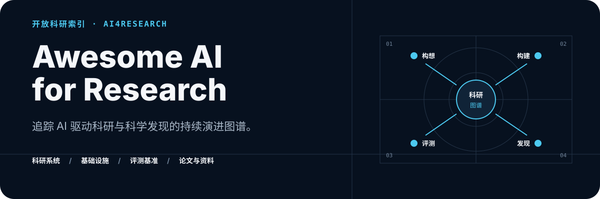

<p align="center">
  
</p>

<p align="center">
  <a href="README.md">English</a> ·
  <a href="README_zh.md"><strong>简体中文</strong></a> ·
  <a href="#探索图谱">探索图谱</a> ·
  <a href="https://github.com/pengqianhan/awesome-AI-for-research/issues">推荐资源</a>
</p>

> 一个持续更新的双语 AI 科研索引：从自主科学家、智能体基础设施和评测基准，到面向智能体的研究成果形态，追踪 AI 驱动科研的真实进展。

这个仓库是一份 AI4Research 生态指南。它按照各类项目在科研循环中的主要作用，整理有代表性的系统、论文、基础设施与基准，帮助读者比较不同路线、发现生态空白，并寻找值得继续探索的方向。

## 探索图谱

- **[AI Scientist](#ai-scientist)** — 端到端科研系统、编码智能体工作流、技能、进化搜索、autoresearch 与自改进 harness。
- **[智能体友好型基础设施](#智能体友好型科研基础设施)** — 帮助智能体读取文献、访问科学知识并保存研究过程与成果的工具和格式。
- **[科研智能体评测](#科研智能体评测基准)** — 覆盖论文复现、科学发现、长期实验与科学编程的评测基准。
- **[论文合集](#论文合集)** — 聚焦 AI 驱动科学发现的主题阅读资料。
- **[xCode 系列](#xcode-系列)** — 与自主科研工作流相邻的编码智能体项目。
- **[相关项目与资源](#相关项目与资源)** — 互补的精选列表与生态图谱。

<sub><strong>收录范围。</strong> 一个项目可能覆盖科研生命周期的多个阶段；这里按其主要作用归类，分类会随领域发展持续调整。</sub>

## AI Scientist

### 基于 API

1. [AI-scientist](https://github.com/SakanaAI/AI-Scientist) [<!--stars:SakanaAI/AI-Scientist-->⭐&nbsp;14.3k<!--/stars-->](https://github.com/SakanaAI/AI-Scientist) and [AI-scientist v2](https://github.com/SakanaAI/AI-Scientist-v2/tree/main) [<!--stars:SakanaAI/AI-Scientist-v2-->⭐&nbsp;6.9k<!--/stars-->](https://github.com/SakanaAI/AI-Scientist-v2) - 自动化科研发现系统，覆盖想法生成、实验执行和论文写作；v2 进一步引入 agentic tree search，面向更强的 workshop 级科学发现。
2. [AI-Researcher(HKUDS)](https://github.com/HKUDS/AI-Researcher) [<!--stars:HKUDS/AI-Researcher-->⭐&nbsp;5.6k<!--/stars-->](https://github.com/HKUDS/AI-Researcher) - 面向自主科学创新的系统，支持从研究构想到实验和论文生成的端到端流程。
3. [Paperorchestra](https://github.com/google-research/paper-orchestra) [<!--stars:google-research/paper-orchestra-->⭐&nbsp;95<!--/stars-->](https://github.com/google-research/paper-orchestra) - 多智能体论文写作框架，可把稀疏想法摘要和原始实验日志转成接近投稿状态的 AI 研究论文。
4. [PaperBanana](https://github.com/dwzhu-pku/PaperBanana) [<!--stars:dwzhu-pku/PaperBanana-->⭐&nbsp;6.8k<!--/stars-->](https://github.com/dwzhu-pku/PaperBanana) - 面向 AI 科学家的学术插图生成框架，用于自动生成论文级方法图和统计图。
5. [Scientist-One](https://github.com/scientist-one/generated-artifacts) [<!--stars:scientist-one/generated-artifacts-->⭐&nbsp;37<!--/stars-->](https://github.com/scientist-one/generated-artifacts) - ScientistOne 能够自主生成具备可验证证据链的研究论文——其每一项主张均可追溯至代码、数据或文献——同时在前沿算法发现任务上，达到甚至超越人类专家的水平。

### 遗传算法和搜索算法结合 LLM

1. [OpenEvolve(alphaevolve)](https://github.com/algorithmicsuperintelligence/openevolve) [<!--stars:algorithmicsuperintelligence/openevolve-->⭐&nbsp;6.8k<!--/stars-->](https://github.com/algorithmicsuperintelligence/openevolve) - AlphaEvolve 风格的开源实现，用进化搜索优化代码和算法。
2. [Claude-Evolve](https://github.com/samuelzxu/claude-evolve) [<!--stars:samuelzxu/claude-evolve-->⭐&nbsp;14<!--/stars-->](https://github.com/samuelzxu/claude-evolve) - Claude Code 插件，用 ShinkaEvolve 风格的进化搜索和多模型/多思考强度组合来演化代码。
3. [MLEvolve](https://github.com/InternScience/MLEvolve) [<!--stars:InternScience/MLEvolve-->⭐&nbsp;405<!--/stars-->](https://github.com/InternScience/MLEvolve) - 自主机器学习算法设计与优化系统，结合渐进式搜索和经验记忆。

### 基于 Claude Code 或 Codex 的科研系统

1. [Auto-claude-code-research-in-sleep(ARIS)](https://github.com/wanshuiyin/Auto-claude-code-research-in-sleep) [<!--stars:wanshuiyin/Auto-claude-code-research-in-sleep-->⭐&nbsp;13.8k<!--/stars-->](https://github.com/wanshuiyin/Auto-claude-code-research-in-sleep) - 轻量级 Markdown-only 科研技能栈，用于自主 ML 研究循环、想法发现、评审和实验自动化。
2. [Academic Research Skills for Claude Code (ARS)](https://github.com/Imbad0202/academic-research-skills/tree/main) [<!--stars:Imbad0202/academic-research-skills-->⭐&nbsp;39.4k<!--/stars-->](https://github.com/Imbad0202/academic-research-skills) - 面向 Claude Code 的学术研究技能流程，覆盖调研、写作、审阅、修订和定稿。
3. [AutoR](https://github.com/AutoX-AI-Labs/AutoR) [<!--stars:AutoX-AI-Labs/AutoR-->⭐&nbsp;871<!--/stars-->](https://github.com/AutoX-AI-Labs/AutoR) - AI 负责执行、人类把握方向的研究系统，每次运行都会沉淀为可检查的磁盘 artifact。
4. [Feynman](https://github.com/companion-inc/feynman/tree/main) [<!--stars:companion-inc/feynman-->⭐&nbsp;8.4k<!--/stars-->](https://github.com/companion-inc/feynman) - 开源 AI 科研代理，支持文献综述、深度研究、模拟评审、审计、复现实验和实验流程。
5. [Deli_AutoResearch](https://victorchen96.github.io/auto_research/framework.html#fullmd) - 面向长期自主任务的协议框架。
6. [ResearchStudio](https://github.com/microsoft/ResearchStudio) [<!--stars:microsoft/ResearchStudio-->⭐&nbsp;1.8k<!--/stars-->](https://github.com/microsoft/ResearchStudio) - 基于 Claude Code 和 Codex 的智能体技能套件，实现从端到端选题立项到论文发表后成果产出的全流程自主科研。

### Skills

1. [Scientific Agent Skills](https://github.com/K-Dense-AI/scientific-agent-skills) [<!--stars:K-Dense-AI/scientific-agent-skills-->⭐&nbsp;31.7k<!--/stars-->](https://github.com/K-Dense-AI/scientific-agent-skills) - 大规模科学智能体技能库，包含面向生物、化学、医学和药物发现的技能与数据库集成。
2. [ToolUniverse](https://github.com/mims-harvard/ToolUniverse) [<!--stars:mims-harvard/ToolUniverse-->⭐&nbsp;1.6k<!--/stars-->](https://github.com/mims-harvard/ToolUniverse) - 面向 AI 科学家的工具生态，为智能体提供科学工具、数据库和执行能力。
3. [Nature Skills](https://github.com/Yuan1z0825/nature-skills) [<!--stars:Yuan1z0825/nature-skills-->⭐&nbsp;31k<!--/stars-->](https://github.com/Yuan1z0825/nature-skills) - 面向论文阅读、写作、同行评审、引用、数据管理和投稿级科研绘图的可复用技能库。

### Heuristic Learning using Claude Code or Codex as optimizer

1. [Learning Beyond Gradients](https://github.com/Trinkle23897/learning-beyond-gradients) [<!--stars:Trinkle23897/learning-beyond-gradients-->⭐&nbsp;603<!--/stars-->](https://github.com/Trinkle23897/learning-beyond-gradients) - 提出 Heuristic Learning 的长文，讨论编码智能体如何在不更新梯度的情况下持续改进软件策略和系统。
2. [HL-ImageNet](https://github.com/xisen-w/hl-imagenet) [<!--stars:xisen-w/hl-imagenet-->⭐&nbsp;65<!--/stars-->](https://github.com/xisen-w/hl-imagenet) - 在 ImageNet 风格视觉识别任务上探索 Heuristic Learning 的实验项目。
3. [Trajevo(Evolving SOTA Trajectory Prediction Heuristics with LLMs)](https://github.com/ai4co/trajevo) [<!--stars:ai4co/trajevo-->⭐&nbsp;21<!--/stars-->](https://github.com/ai4co/trajevo) - 使用 LLM 驱动的进化流程来设计轨迹预测启发式方法。
4. [PatchWorld: Learning Executable World Models without Gradients](https://github.com/HKBU-KnowComp/PatchWorld) [<!--stars:HKBU-KnowComp/PatchWorld-->⭐&nbsp;7<!--/stars-->](https://github.com/HKBU-KnowComp/PatchWorld) - 无梯度框架，通过反例驱动的代码修复，从离线轨迹中归纳可检查的 Python 世界模型。

### Autoresearch related

1. [autoresearch](https://github.com/karpathy/autoresearch) [<!--stars:karpathy/autoresearch-->⭐&nbsp;92k<!--/stars-->](https://github.com/karpathy/autoresearch) - 极简单卡 nanochat 研究循环，让智能体编辑训练代码、运行限时实验，并自动保留或回滚改动。
2. [Autoresearch Paradigm Fire](https://github.com/DeveshParagiri/ed-autoresearch) [<!--stars:DeveshParagiri/ed-autoresearch-->⭐&nbsp;0<!--/stars-->](https://github.com/DeveshParagiri/ed-autoresearch) - 关于扩展 autoresearch 循环的文章，讨论如何超越基础的指标优化智能体。
3. [PrimeIntellect](https://github.com/PrimeIntellect-ai/experiments-autonomous-speedrunning) [<!--stars:PrimeIntellect-ai/experiments-autonomous-speedrunning-->⭐&nbsp;109<!--/stars-->](https://github.com/PrimeIntellect-ai/experiments-autonomous-speedrunning) - Prime Intellect 的自主 nanoGPT speedrun 实验，让 Codex 和 Claude Code 在大规模算力上搜索优化器方案。
4. [AutoScientists](https://github.com/mims-harvard/AutoScientists/tree/main) [<!--stars:mims-harvard/AutoScientists-->⭐&nbsp;706<!--/stars-->](https://github.com/mims-harvard/AutoScientists) - 面向长期科学实验的自组织多智能体团队框架。
5. [DeLM](https://github.com/yuzhenmao/DeLM) [<!--stars:yuzhenmao/DeLM-->⭐&nbsp;99<!--/stars-->](https://github.com/yuzhenmao/DeLM) - 去中心化多智能体框架，让并行智能体通过共享的已验证上下文和任务队列协作。（注：第 4 和第 5 项都使用并行智能体开展研究）
6. [ENPIRE](https://research.nvidia.com/labs/gear/enpire/#article-title) - Agentic Robot Policy
Self-Improvement in the Real World (ENPIRE)，让机器人智能体在物理世界中通过自主实验和改进来提升性能。

### AI4LLM

1. [Autoresearch](https://github.com/karpathy/autoresearch) [<!--stars:karpathy/autoresearch-->⭐&nbsp;92k<!--/stars-->](https://github.com/karpathy/autoresearch) - 用于单卡 LLM 训练研究的紧凑型自主实验循环。
2. [ML-Intern](https://github.com/huggingface/ml-intern) [<!--stars:huggingface/ml-intern-->⭐&nbsp;10.7k<!--/stars-->](https://github.com/huggingface/ml-intern) - 开源 ML 工程师智能体，可阅读论文、训练模型并交付机器学习 artifact。

### RSI (recursive self improvement) / Harness Engineering

1. [LLM Powered Autonomous Agents](https://lilianweng.github.io/posts/2023-06-23-agent/) - Lilian Weng 的博客，这篇博客详细介绍了如何以大型语言模型（LLM）作为核心大脑来构建自主代理（Autonomous Agents），并深入探讨了实现该系统的三大关键组件：任务规划（Planning）、记忆机制（Memory）和工具使用（Tool Use）。
2. [When AI builds itself](https://www.anthropic.com/institute/recursive-self-improvement) - 这篇博客探讨了人工智能发展中的自我进化趋势，指出随着AI系统能力的提升，它们越来越多地参与到自身的设计与开发中，这不仅加速了技术进步，也预示着能够完全自主设计其继任者的“递归自我改进”AI可能比预期更早到来，从而带来巨大的机遇与潜在风险。
3. [Meta-Harness](https://github.com/stanford-iris-lab/meta-harness) [<!--stars:stanford-iris-lab/meta-harness-->⭐&nbsp;1.3k<!--/stars-->](https://github.com/stanford-iris-lab/meta-harness) - Meta-Harness 论文的参考代码，用于在昂贵评估条件下搜索 agent harness。
4. [AutoScientists](https://github.com/mims-harvard/AutoScientists) [<!--stars:mims-harvard/AutoScientists-->⭐&nbsp;706<!--/stars-->](https://github.com/mims-harvard/AutoScientists) - 基于自组织多智能体团队的长期科学实验框架。
5. [DeepScientist](https://github.com/ResearAI/DeepScientist) [<!--stars:ResearAI/DeepScientist-->⭐&nbsp;3.2k<!--/stars-->](https://github.com/ResearAI/DeepScientist) - 本地优先的自主科研工作室，管理 baseline、实验轮次、记忆和论文级输出。
6. [evoscientist](https://github.com/EvoScientist/EvoScientist) [<!--stars:EvoScientist/EvoScientist-->⭐&nbsp;4.3k<!--/stars-->](https://github.com/EvoScientist/EvoScientist) - 自进化 AI 科学家项目，关注迭代式、智能体驱动的研究流程。

## 智能体友好型科研基础设施

1. [Hugging Face Hub CLI](https://github.com/huggingface/huggingface_hub) [<!--stars:huggingface/huggingface_hub-->⭐&nbsp;3.8k<!--/stars-->](https://github.com/huggingface/huggingface_hub) - Hugging Face Hub 命令行工具，用于管理模型、数据集和 Spaces，支持智能体友好的科研工作流。`hf papers read` 可将 Hugging Face Hub 上的论文读取为 Markdown。

   ```text
   Usage: hf papers read [OPTIONS] PAPER_ID

     Read a paper as markdown.

   Arguments:
     PAPER_ID  The arXiv paper ID (e.g. '2502.08025').  [required]
   ```

2. [Adding arXiv and 150M+ abstracts to Paperclip](https://gxl.ai/blog/adding-arxiv-and-abstracts) - 介绍 Paperclip 如何为智能体索引 arXiv 全文和 OpenAlex 规模的摘要语料，支持搜索、阅读和综合。
3. [DeepXiv SDK](https://github.com/DeepXiv/deepxiv_sdk) [<!--stars:DeepXiv/deepxiv_sdk-->⭐&nbsp;742<!--/stars-->](https://github.com/DeepXiv/deepxiv_sdk) - 用于和 arXiv 论文对话的 Python 包与 AI agent 接口。
4. [arxiv2md](https://github.com/timf34/arxiv2md) [<!--stars:timf34/arxiv2md-->⭐&nbsp;192<!--/stars-->](https://github.com/timf34/arxiv2md) - 代替解析 PDF（慢且容易出错），arxiv2md 解析 arXiv 为新论文提供的结构化 HTML。这意味着清晰的章节边界、正确的数学公式（MathML → LaTeX）、可靠的表格和快速处理——无需 OCR。
5. [AI 方法演化图谱](https://intern-atlas.opendatalab.org.cn/#api) - 面向智能体的结构化、可查询 AI 方法演化图谱，可作为科学记忆层。
6. [The Last Human-Written Paper Agent-Native Research Artifacts](https://github.com/Orchestra-Research/Agent-Native-Research-Artifact) [<!--stars:Orchestra-Research/Agent-Native-Research-Artifact-->⭐&nbsp;523<!--/stars-->](https://github.com/Orchestra-Research/Agent-Native-Research-Artifact) - 提出用机器原生研究 artifact 替代扁平论文，保留逻辑、代码、探索轨迹和证据。
7. [General Agent: A Self-Evolving, Synthetic Agent Environment](https://www.primeintellect.ai/blog/general-agent) - 自进化合成智能体环境，通过持续扩展任务语料来提升 agent 训练的多样性和难度。
8. [sepo: self-evolving repository(use GitHub to manage long-horizon tasks)](https://github.com/self-evolving/repo/tree/main) [<!--stars:self-evolving/repo-->⭐&nbsp;48<!--/stars-->](https://github.com/self-evolving/repo) - GitHub-native agent 模板，用 issue、PR、Actions、分支和仓库记忆承载长期任务。
9. [AirXiv](https://airaxiv.com/) - 面向 AI 生成论文和人类论文的 AI 驱动开放预印本平台，并提供 AI 评审支持。
10. [OKF](https://github.com/GoogleCloudPlatform/knowledge-catalog/tree/main/okf) [<!--stars:GoogleCloudPlatform/knowledge-catalog-->⭐&nbsp;7.7k<!--/stars-->](https://github.com/GoogleCloudPlatform/knowledge-catalog) - 一个开源的知识库格式，用于存储和检索科学知识。
11. [ModernTSF](https://github.com/Diaugeia/ModernTSF/tree/main) [<!--stars:Diaugeia/ModernTSF-->⭐&nbsp;60<!--/stars-->](https://github.com/Diaugeia/ModernTSF) - 面向时间序列预测的 AI Infrastructure —— 而不只是又一个工具包。 一个统一、可复现的底座，让人和 Agent 都把时间花在创新 idea 上， 而不是它周围的各种胶水工作
12. [Sciverse](http://sciverse.space/docs#overview) - 一个面向 agentic research papers 的平台。
## 科研智能体评测基准

1. [PaperBench](https://github.com/paperbench/paperbench) - 用于评估智能体从零复现 AI 研究论文能力的基准；当前列出的 GitHub URL 可能需要核对。
2. [ResearchClawBench](https://github.com/InternScience/ResearchClawBench) [<!--stars:InternScience/ResearchClawBench-->⭐&nbsp;224<!--/stars-->](https://github.com/InternScience/ResearchClawBench) - 用于评估 AI 智能体自动科研能力的基准，覆盖从 rediscovery 到 new discovery 的任务。
3. [EinsteinArena](https://github.com/vinid/einstein-arena) [<!--stars:vinid/einstein-arena-->⭐&nbsp;40<!--/stars-->](https://github.com/vinid/einstein-arena) - 开放竞技场，让 AI 智能体围绕未解决科学和优化问题协作、竞争并提交解法。
4. [MLS-Bench](https://github.com/Imbernoulli/MLS-Bench) [<!--stars:Imbernoulli/MLS-Bench-->⭐&nbsp;73<!--/stars-->](https://github.com/Imbernoulli/MLS-Bench) - Machine Learning Science 基准，用于测试智能体是否能提出原子化、可泛化的 ML 科研贡献。
5. [Autolab](https://github.com/autolabhq/autolab) [<!--stars:autolabhq/autolab-->⭐&nbsp;157<!--/stars-->](https://github.com/autolabhq/autolab) - 面向前沿超长周期自主科研任务的评测基准。
6. [NatureBench](https://github.com/FrontisAI/NatureBench) [<!--stars:FrontisAI/NatureBench-->⭐&nbsp;78<!--/stars-->](https://github.com/FrontisAI/NatureBench) - NatureBench 是一个科学机器学习基准，旨在评估代码智能体能否通过编写代码，复现甚至超越《自然》（Nature）系列期刊论文中公布的最先进（SOTA）实验结果。

## 论文合集

1. [AI Discovery in the Wild (CAIS 2026 Workshop)](https://ai-discovery-in-the-wild.github.io/papers.html) - CAIS 2026 研讨会论文合集，主题是面向真实科学发现的 AI 智能体。

## xCode 系列

1. [MiMo-Code](https://github.com/XiaomiMiMo/MiMo-Code) [<!--stars:XiaomiMiMo/MiMo-Code-->⭐&nbsp;12.4k<!--/stars-->](https://github.com/XiaomiMiMo/MiMo-Code) - 小米 MiMo 的 coding-agent CLI，定位为下一代 agent 起点，并与 OpenCode 生态相关。
2. [OpenCode](https://github.com/anomalyco/opencode) [<!--stars:anomalyco/opencode-->⭐&nbsp;189.4k<!--/stars-->](https://github.com/anomalyco/opencode) - 开源 coding agent，用于终端中的软件工程工作流。
3. [Kimi-Code](https://github.com/MoonshotAI/kimi-code) [<!--stars:MoonshotAI/kimi-code-->⭐&nbsp;5k<!--/stars-->](https://github.com/MoonshotAI/kimi-code) - Moonshot AI 的 Kimi Code CLI，面向下一代 coding-agent 工作流。

## 相关项目与资源

1. [Awesome-Autoresearch](https://github.com/alvinreal/awesome-autoresearch) [<!--stars:alvinreal/awesome-autoresearch-->⭐&nbsp;2.3k<!--/stars-->](https://github.com/alvinreal/awesome-autoresearch) - 自主改进循环、research agents 和 autoresearch 风格系统的精选列表。
2. [Awesome-Auto-Research-Tools](https://github.com/handsome-rich/Awesome-Auto-Research-Tools) [<!--stars:handsome-rich/Awesome-Auto-Research-Tools-->⭐&nbsp;1.1k<!--/stars-->](https://github.com/handsome-rich/Awesome-Auto-Research-Tools) - 自动化科研工具合集，覆盖文献搜索、论文阅读、实验管理和代码生成。
3. [Awesome-AI-for-Research](https://github.com/WecoAI/awesome-ai-for-research) - AI research 工具相关的 awesome-list 风格资源；当前列出的 GitHub URL 可能需要核对。
4. [Awesome-Autoresearch(A curated awesome list of public autoresearch use cases across industries.)](https://github.com/yibie/awesome-autoresearch) [<!--stars:yibie/awesome-autoresearch-->⭐&nbsp;656<!--/stars-->](https://github.com/yibie/awesome-autoresearch) - 公开 autoresearch 用例、基准、研讨会和行业案例的精选列表。
5. [Awesome-Vibe-Research](https://github.com/modelscope/Awesome-Vibe-Research) [<!--stars:modelscope/Awesome-Vibe-Research-->⭐&nbsp;371<!--/stars-->](https://github.com/modelscope/Awesome-Vibe-Research) - 面向 AI 辅助科研的开放共建仓库, 收集和沉淀科研全流程中的 agents、skills、workflows、tools 与最佳实践
6. [Awesome-AI-for-Research](https://github.com/THU-KEG/Awesome-AI-for-Research) [<!--stars:THU-KEG/Awesome-AI-for-Research-->⭐&nbsp;109<!--/stars-->](https://github.com/THU-KEG/Awesome-AI-for-Research) - THU-KEG 使用 AI 提升科研效率，拓展科研探索空间。从聚焦工具到参与并重塑科研流程的智能体。
7. [Awesome-LLM-Scientific-Discovery](https://github.com/HKUST-KnowComp/Awesome-LLM-Scientific-Discovery) [<!--stars:HKUST-KnowComp/Awesome-LLM-Scientific-Discovery-->⭐&nbsp;422<!--/stars-->](https://github.com/HKUST-KnowComp/Awesome-LLM-Scientific-Discovery) - 一个为科学发现精心搜集的大语言模型（LLM）资源列表，包含相关工具、数据集和论文。
8. [Awesome AI for Science](https://github.com/ai4s-research/awesome-ai-for-science) [<!--stars:ai4s-research/awesome-ai-for-science-->⭐&nbsp;1.8k<!--/stars-->](https://github.com/ai4s-research/awesome-ai-for-science) - 面向跨学科科学发现的 AI 工具、库、论文、数据集和框架精选合集。

## 贡献与维护

欢迎通过 [GitHub Issues](https://github.com/pengqianhan/awesome-AI-for-research/issues) 推荐资源。提交时请附上项目的官方链接，并简要说明它如何服务于 AI 驱动科研。

- 分类会随生态变化持续调整，不追求一成不变。
- 资源条目应当具体、可检索，并便于横向比较。
- 优先收录有代表性的系统与一手资料，而非宣传性汇总文章。
